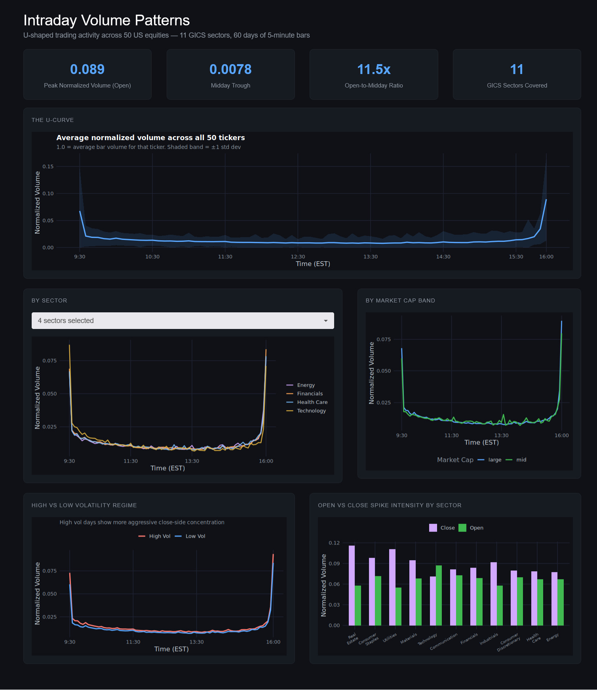

# Intraday Volume Patterns

A data and analytics engineering project studying the U-shaped intraday volume curve in US equity markets, built on a production-grade stack: Python ingestion, ClickHouse columnar storage, dbt transformation layers, and an R Shiny dashboard.



## The idea

Trading volume in the stock market is not evenly distributed throughout the day. It spikes at open as traders react to overnight news and pre-market moves, fades through midday as the market digests information, then picks back up aggressively into the close as institutions rebalance portfolios and index funds execute end-of-day orders. This U-shape is well documented in market microstructure literature, but the interesting questions sit on top of it.

Does the curve look the same for a mid-cap energy company as it does for Apple? Do sectors with heavier retail participation have a more pronounced open spike than institutional-heavy sectors like Financials? And critically — does the shape change when the market is stressed? On high-volatility days, do traders concentrate even more aggressively at open and close out of caution about holding positions through the session?

Those are the questions this project is built to answer.

## Data

The ingestion script pulls three datasets from yfinance for 50 tickers spread across all 11 GICS sectors, with a mix of large and mid cap names:

**5-minute intraday OHLCV** for the last 60 days — the primary dataset. Each bar represents a 5-minute window of trading activity with open, high, low, close, and volume. This is the raw material for the U-curve.

**Daily OHLCV** for the last 2 years — used downstream to compute rolling realized volatility per ticker. This is what enables the volatility regime analysis.

**Ticker metadata** — sector, industry, market cap, and market cap band per ticker. This is what enables the sector and size breakdowns.

## Architecture

The project uses three separate ClickHouse databases to represent data layers — the ClickHouse equivalent of schema separation in Postgres or Snowflake.

```
raw         Python ingestion only. dbt never touches this.
staging     dbt views. Cleaning, filtering, derived fields.
marts       dbt MergeTree tables. The actual analytics.
```

A custom `generate_schema_name` macro overrides dbt's default behavior, which concatenates the profile schema with the custom schema and produces names like `staging_staging`. The override makes each layer write to its own database cleanly.

## Transformation logic

**Staging** is where raw data gets shaped into something analytically useful. `stg_intraday_bars` filters to regular trading hours only (14:30–21:00 UTC, equivalent to 09:30–16:00 EST), removes zero-volume bars, and computes `minutes_since_open` — the main time axis for every downstream chart, where 0 is the open and 385 is the close. `stg_daily_bars` computes daily close-to-close returns which feed into the volatility models.

**Marts** build up in sequence. `mart_normalized_volume` is the foundation — it divides each bar's volume by that ticker's average daily total volume. This normalization is what makes patterns comparable across tickers with very different absolute trading sizes; without it, Apple's volume would dominate every aggregate. From there, four aggregation models build the curves: the overall U-curve across all tickers and days, the curve broken down by GICS sector, by market cap band, and by volatility regime. `mart_daily_volatility` computes rolling 20-day realized volatility (annualized) and classifies each trading day as high or low volatility relative to that ticker's own historical median — a per-ticker relative classification rather than an absolute threshold.

## Dashboard

The R Shiny dashboard connects directly to the ClickHouse marts layer and loads all data at startup, keeping the UI fast and stateless. It has four KPI cards at the top — peak normalized volume, midday trough, open-to-midday ratio, and sector count — followed by five charts.

The overall U-curve shows the shape across all 50 tickers with a ±1 standard deviation band. The sector chart has a searchable multi-select picker so you can compare any combination of the 11 sectors directly. The market cap chart shows large vs mid cap patterns side by side. The volatility regime chart is the most analytically interesting — high volatility days show a noticeably more aggressive close-side spike, which reflects how institutional traders behave when markets are moving and liquidity is uncertain. The final chart summarizes open and close spike intensity per sector in a grouped bar, making it easy to see which sectors are most time-of-day sensitive.

## Key findings

The open-to-midday volume ratio is 11.5x across the full universe — volume at the open is more than eleven times the midday average. The close spike is comparably large. The shape holds across all 11 sectors but the intensity varies: Real Estate and Utilities show the most pronounced close spikes relative to their average, while Technology and Communication have the sharpest open bursts. On high-volatility days the close spike is meaningfully larger than on low-volatility days, consistent with the theory that uncertainty pushes execution toward the close where more liquidity is available.

## Stack

Python · yfinance · ClickHouse · dbt · R · Shiny · ggplot2 · Docker